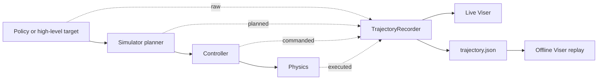

# Policy trajectory visualization

CaP-X can record and visualize the same four-stage policy trajectory in LIBERO
and RoboTwin. Recording is always enabled in these two adapters. Setting
`viser_debug: true` adds a live Viser view; setting `output_dir` also saves a
replayable `trajectory.json` beside the normal trial artifacts.

## Architecture and simulator boundary



The recorder and renderer are observers; they do not replace planner,
controller, or physics calls. Recorder updates remain active if Viser cannot be
created, and renderer failures are isolated from simulator stepping. RoboTwin
records every physics step but refreshes the live renderer at a bounded cadence
(50 physics steps by default), so visualization traffic does not discard the
full offline trajectory.

In the Web UI, simulator construction, stepping, rendering, and shutdown stay
on one owner thread. Each session retains the exact Viser port that it created;
the proxy never borrows another session's port. Timeouts preserve the last
trajectory snapshot as a truncated failure instead of resetting and erasing the
evidence.

## What the view means

| Layer | Color | Meaning |
| --- | --- | --- |
| `raw` | gray axes | Discrete high-level policy or planner targets; not connected by default |
| `planned` | blue | Planner joint waypoints, converted to world/base-frame EEF poses with the embodiment URDF |
| `commanded` | orange | Joint or drive targets sent to the controller |
| `executed` | green | Measured simulator state and EEF pose after stepping physics |
| infeasible segment | red | A supplied IK, joint-limit, collision, planner, or clearance check failed |

The GUI has a timestep scrubber, one visibility toggle per layer, EEF-axis
visibility, sample counts, arm names, and the number of samples flagged as
infeasible. The robot follows the selected timestep when the simulator has
provided a matching URDF state setter.

The status panel also shows the latest known planner result (`success`,
`failed`, or `unknown`), task predicate (`success`, `incomplete`, or `unknown`),
and latest/maximum tracking error when supplied. These are independent signals:
planner success is not task completion, and `unknown` is never treated as a
pass.

### Coordinate-frame contract

Every EEF pose carries a non-empty `frame_id` alongside `position` and
scalar-first `wxyz`. Producers should name the actual frame, such as `world`,
`robot_base`, or a calibrated task frame. For artifacts written before this
field existed, `artifact.metadata.eef_frame_id` takes precedence; historical
LIBERO artifacts migrate to `robot0_base`, while other legacy artifacts default
to `world`.

Viser never overlays different frame IDs as if their coordinates were
commensurate. It displays one active frame at a time, preferring `world`, and
lists hidden frames in the status panel. Use
`renderer.set_frame_id("robot_base")` to inspect another recorded frame. To
compare poses together, transform them into one common frame before appending;
merely relabeling a pose is incorrect.

### Path-continuity contract

Lines are built only within a contiguous trajectory run. The renderer uses
`sample.metadata.segment_id` when present, otherwise `plan_id`; a change in the
effective ID, a coordinate-frame change, or a sample with missing FK ends the
run. Samples without either ID remain continuous for backward compatibility.
`segment_id` takes priority because one plan may contain several independently
meaningful motions. Raw high-level targets remain discrete axes unless a caller
explicitly sets `connect_raw_targets=True`.

The visualization is diagnostic rather than a collision certificate. A red
segment is meaningful only for checks actually supplied by the planner or
simulator. `null` feasibility fields mean “not evaluated,” not “passed.” The
Web completion card separately reports planner success, the agent's `Finish`
decision, and the simulator's task predicate. An incomplete task does not by
itself turn an otherwise feasible motion path red.

## Reading a policy rollout

Use the four layers as a causal trace rather than treating the green path alone
as success:

| Observation | Likely interpretation |
| --- | --- |
| Raw target exists, planner is failed, and no planned run follows | The requested motion was rejected before controller execution |
| Planned run exists but commanded/executed samples stop early | Execution was rejected, interrupted, or timed out |
| Commanded and executed paths separate with rising tracking error | Controller or dynamics tracking is the limiting stage |
| Planned, commanded, and executed paths agree but task is incomplete | The motion was feasible, but it did not solve the task predicate |
| A segment is red | A supplied IK, joint-limit, collision, or planner check is false, or reported clearance is negative |
| A check is `unknown` or `null` | That property was not evaluated; no feasibility conclusion is available |

For a new policy, first select the intended `frame_id`, then scrub to the first
layer divergence. Inspect its `segment_id` and feasibility fields
(`ik_ok`, `joint_limit_ok`, `collision_free`, `planner_success`,
`task_success`, `min_clearance_m`, and `tracking_error_m`). Finally, confirm the
simulator task predicate independently of the agent's decision to stop.

## Live use

RoboTwin has a ready-to-run trajectory config:

```bash
ROBOTWIN_ROOT=/path/to/RoboTwin uv run capx/envs/launch.py \
  --config-path env_configs/robotwin/stack_blocks_two_privileged_oracle_trajectory.yaml
```

For LIBERO, use either existing Viser config:

```bash
uv run --no-sync --active capx/envs/launch.py \
  --config-path env_configs/libero/franka_libero_wine_bottle_cabinet_viser.yaml
```

For any other LIBERO or RoboTwin YAML, add `viser_debug: true` to the nested
`cfg.low_level` mapping. Keep `num_workers: 1` for an interactive live view.
Batch workers still record trajectory artifacts when Viser is disabled.
RoboTwin retains 10,000 samples per layer by default; raise
`trajectory_max_samples_per_layer` for tasks with longer native physics traces.

The interactive Web UI enables Viser on both the execution wrapper and nested
simulator automatically:

```bash
uv run capx/envs/launch.py \
  --config-path env_configs/robotwin/stack_blocks_two_privileged_oracle.yaml \
  --web-ui
```

The backend remembers the exact port selected by Viser and proxies both HTTP
and WebSocket traffic through `/viser-proxy`. Simulator construction, stepping,
rendering, and shutdown stay on one owner thread so MuJoCo/SAPIEN graphics
contexts are not closed from the event-loop thread. A completed session keeps
its view alive across page refreshes until it is explicitly stopped or replaced
by a new session.

### Runtime isolation

Viser is optional at simulator runtime. If a RoboTwin or LIBERO environment
does not contain compatible Viser dependencies, keep recording enabled, leave
`viser_debug: false`, and save `trajectory.json` through `output_dir`. Replay it
from the normal project environment afterward. Do not add another simulator
environment's entire `site-packages` directory just to obtain Viser: that can
silently replace NumPy, Torch, or graphics dependencies used by MuJoCo/SAPIEN.

This fallback changes only where rendering happens. The artifact schema and the
planned/commanded/executed semantics are identical between live and offline
views.

## Offline replay

Every saved trial contains:

```text
trial_XX_.../
  code.py
  summary.txt
  trajectory.json
```

Replay paths and EEF frames directly:

```bash
uv run python -m capx.visualization.replay \
  outputs/.../trial_XX_.../trajectory.json --port 8080
```

For an artifact that has joint states but no recorded FK pose, supply a matching
URDF to animate the first recorded arm:

```bash
uv run python -m capx.visualization.replay trajectory.json \
  --urdf /path/to/robot.urdf --port 8080
```

Offline URDF replay never assumes that equal-length vectors share joint order.
It accepts an exact joint-name set, reordering values by name, plus one explicit
canonical Panda alias: LIBERO `robot0_joint1..7` maps to
`panda_joint1..7`. Alias replay requires all seven joints and exactly matching
dimensions. Unknown names, partial Panda vectors, extra gripper joints, and all
other dimension mismatches are skipped instead of driving the wrong joints.

The JSON schema is versioned and simulator-independent. Each sample contains
`sequence`, `step`, `timestamp_s`, `layer`, named arm states, optional EEF pose
in scalar-first `wxyz` with an explicit `frame_id`, feasibility metrics,
simulator payload, and metadata. Version-1 artifacts without `frame_id` use the
metadata/LIBERO migration rule above. Use
`TrajectoryArtifact.load_json()` for analysis without starting Viser.

## Simulator coverage

LIBERO records controller targets and measured MuJoCo state on every control
step. Successful CuRobo paths are recorded as planned waypoints and use Panda
URDF FK. A calibrated fixed hand-to-controller transform puts that FK in the
same `robot0_base` convention as measured MuJoCo poses. Its existing Viser scene
also provides RGB-D point-cloud context.

RoboTwin instruments native `task.move`, `take_dense_action`, articulation drive
targets, and `scene.step` without changing the external RoboTwin checkout. It
records both arms, uses the selected embodiment's joint names and URDF transform
chain, and restores all monkey patches on reset or close. Actor markers provide
task-space context; calibrated camera point clouds are intentionally not inferred
when camera intrinsics/extrinsics are unavailable.

## Reference validation

The following real-simulator acceptance runs were completed on 2026-07-20.
Counts are evidence for the implementation, not fixed values that every policy
must reproduce.

| Simulator and case | Terminal result | Recorded evidence |
| --- | --- | --- |
| LIBERO oracle | Task success; reward 1; not truncated | 580 commanded and 580 executed samples; only `robot0_base`; canonical seven-joint Panda names |
| LIBERO direct planned-path smoke | Live Viser HTTP 200 | Planned, commanded, and executed EEF poses present; static FK error `2.55e-12 m`; dynamic error `6.65e-6 m` |
| RoboTwin ALOHA oracle | Planner and task success; 4,139 physics steps | raw 16, planned 4,139, commanded 4,156, executed 4,140; 16 plan lineages complete; no layer truncated |
| RoboTwin planner-failure case | Planner failed; task incomplete | Eight infeasible samples; offline Viser reported the failure rather than treating missing progress as success |

For the successful RoboTwin run, all 82 expected 50-step renderer ticks were
observed. Maximum EEF FK error was `1.57e-7 m` for the left arm and `3.63e-8 m`
for the right arm. Offline Viser returned HTTP 200 for both success and failure
artifacts and displayed distinct planner/task status. Source and artifact SHA256
manifests passed for both simulators.

Run the focused local regression and Web build with:

```bash
.venv/bin/pytest -q \
  tests/test_trajectory_visualization.py \
  tests/test_libero_trajectory.py \
  tests/test_robotwin_trajectory.py \
  tests/test_robotwin_adapter.py \
  tests/test_web_visualization.py \
  tests/test_trajectory_artifact_saving.py \
  viewer/tests/test_viewer.py
npm --prefix web-ui run build
```

## Python interface

Low-level adapters expose:

```python
summary = env.trajectory_summary()       # compact and JSON-safe
artifact = env.trajectory_snapshot()     # immutable full snapshot
artifact.save_json("trajectory.json")
```

New adapters can use `TrajectoryRecorder.append_raw()`, `append_planned()`,
`append_commanded()`, and `append_executed()`, then attach a
`ViserTrajectoryRenderer`. The recorder is bounded and thread-safe; renderer
subscriber failures cannot make simulator stepping fail.

Planner waypoints should make both coordinate frame and continuity explicit:

```python
recorder.append_planned(
    step=waypoint_index,
    arms={
        "left": ArmState(
            ee_pose=EndEffectorPose(
                position=(x, y, z),
                wxyz=(w, qx, qy, qz),
                frame_id="world",
            )
        )
    },
    metadata={"plan_id": plan_id, "segment_id": motion_id},
)
```

## Troubleshooting

- If live Viser initialization fails, trajectory recording and JSON export keep
  working; inspect the runtime warning and replay later.
- If a planned line is absent but joint samples exist, check that the matching
  URDF assets are installed and that the recorded joint names match its actuated
  joints.
- If the status lists hidden frames, select the intended frame or fix the
  producer-side transform; do not remove `frame_id` to force an overlay.
- If the Web iframe says Viser is unavailable, confirm that the current session
  has finished environment initialization; the proxy does not guess another
  session's port before that point.
- Do not interpret missing collision or clearance metrics as successful checks.
